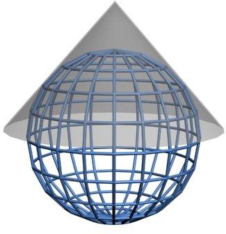
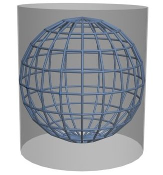
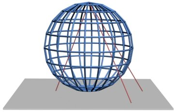

# What is geoinformation?

What is geoinformation? And how is it stored exactly? How are coordinates stored? We cover all of that on this page.

## The power of geoinformation

What can you do with geoinformation, also called spatial information? Geodata is everywhere around us. People often say that 80% of all data is about a place on Earth.

Data with geolocation is used in many domains. A few examples:

### Urban planning

Municipalities use geodata when planning new neighborhoods. Factors such as soil conditions, proximity to facilities, traffic flows, water drainage, and parcel ownership all play an important role. For these analyses, among others, topographic maps (roads, buildings), cadastral data (parcel boundaries), and 3D models (elevation data) are used.

### Living environment and environment

Air quality and preventing noise nuisance are crucial aspects of urban living environments. Analyses help identify problem locations and define measures. The geolocation of sensors in relation to landscape, buildings, and infrastructure is essential.

### Logistics and services

For parcel distribution or household waste collection, optimal route planning is important to save fuel, time, and costs. This requires data such as road networks (roads, traffic intensity), real-time traffic information, and the geolocation of pickup and delivery points.

### Emergency services and risk management

Geoinformation is indispensable for emergency services, for example to map risk areas and special locations. Elevation maps are important for estimating flood risks, and base registries provide insight into locations of schools or convention centers. In addition, PDOK provides (INSPIRE) datasets with specific risk areas.

!!! question "Question"

    Which other applications of geoinformation do you know? Write down a few examples.

## Base registries

Many datasets at PDOK are base registries. What exactly is a base registry?

A base registry is an official, national registry in which data used by many government organizations is recorded. Think of it as a shared set of central data: one place with reliable, up-to-date, and uniform data, so everyone uses the same information.

### Characteristics of a base registry

- **Authentic data:** The information is legally established and cannot simply be changed.
- **Uniform use:** Governments and organizations must use this data in their processes.
- **Up-to-date and reliable:** Strict maintenance and quality rules apply.

The following base registries do not contain geoinformation:

- BRP – Personal Records Database
- HR – Trade Register
- BRV – Vehicle Registration Database
- BRI – Income Registry

And the following base registries contain geodata that PDOK delivers (partly):

- BRT – Topography Registry
- BRK – Cadastre Registry
- WOZ – Property Valuation Registry
- BAG – Addresses and Buildings Registry
- BGT – Large-scale Topography Registry
- BRO – Subsurface Registry

### Why is this important?

Imagine every government organization kept its own address list. You would get errors, such as issues when requesting utility connections during moves, duplicate records, and lots of confusion. By using one national base registry, all parties work with the same information. That saves time, prevents errors, and makes collaboration easier.

[Here you can find more information about the base registry system.](https://www.digitaleoverheid.nl/overzicht-van-alle-onderwerpen/stelsel-van-basisregistraties/10-basisregistraties/)

## How is geodata stored?

Geodata can be stored in different ways in a file or database. The storage method affects what you can do with the data. This is especially true for spatial data, because geometry can be represented in many different ways. It strongly depends on the intended use of the data.

## Raster or vector data?

There are roughly two forms of geodata: vector data and raster data. In raster data, information is stored in an image. A raster file consists of a complete grid. A raster file contains one or more bands. Each raster cell ("pixel") in each band has a numeric value. Together these values can represent a color, for example in an aerial photo or satellite image. Then there is a band for Red, Green, and Blue (RGB). But values in single-band raster files can also represent something else, such as elevation or temperature.

Vector data uses a completely different approach. In vector data, information is stored in a table with geometry. Geometry can be stored as a set of coordinates in a table attribute (with its own *geometry* data type). The geometry can be a point, line, or polygon.

Raster and vector data each have specific advantages and disadvantages due to how the data is stored. That is why raster and vector data have different use cases.

In general (with exceptions), raster data is used for continuous phenomena such as elevation and temperature. These natural phenomena have no hard boundaries and continue continuously. This differs from discrete information, such as buildings and administrative boundaries, which start and end at positions defined by people. For discrete phenomena, we mainly use vector data.

!!! warning "TO DO"

    Add image

Examples of raster datasets at PDOK:

* [Actueel Hoogtebestand Nederland (AHN)](https://www.pdok.nl/introductie/-/article/actueel-hoogtebestand-nederland-ahn) for elevation data
* [Landelijk Grondgebruik Nederland](https://www.pdok.nl/introductie/-/article/landelijk-grondgebruik-nederland-lgn-)
* [Aerial photo RGB](https://www.pdok.nl/introductie/-/article/pdok-luchtfoto-rgb-open-) and [Aerial photo Infrared](https://www.pdok.nl/introductie/-/article/pdok-luchtfoto-infrarood-open-)

Examples of vector datasets at PDOK:

* The [BRT Background Map](https://www.pdok.nl/introductie/-/article/basisregistratie-topografie-achtergrondkaarten-brt-a-)
* The [Addresses and Buildings Registry (BAG)](https://www.pdok.nl/introductie/-/article/basisregistratie-adressen-en-gebouwen-ba-1), including building data
* [CBS Wijken en Buurten](https://www.pdok.nl/introductie/-/article/cbs-wijken-en-buurten), with statistical data on neighborhoods, districts, and municipalities

## What are coordinate reference systems?

!!! warning "TO DO"

Geodata is always stored in a specific coordinate reference system (CRS). The CRS determines how coordinates are stored. In other words: how a position on Earth is determined. The Earth is not flat, although maps are. Unfortunately, Earth is also not perfectly round or oval.

    

Earth looks more like a potato, with mountains and valleys. We call this a geoid. That geoid is infinitely complex, which makes it hard to store its exact shape in a computer. Therefore, people approximate it with an ellipsoid (3D oval). This leads to deviations: some places deviate more from the ellipsoid than others. But for many global-scale applications, some deviation is acceptable.

    

For many applications, accuracy is important. Then you need an ellipsoid that closely matches the part of Earth you are interested in. In other parts of Earth, that ellipsoid may not match at all. This is called a local coordinate system. The Dutch national grid (Rijksdriehoeksstelsel), also called "RD Amersfoort", is such a local coordinate system. RD Amersfoort provides high accuracy in the Netherlands, but is not useful outside the Netherlands.

We are still not done. What if you project that ellipsoid onto a flat surface? Imagine peeling a mandarin and trying to lay the peel flat in one piece—you get gaps. Map projections are ways to distort and stretch the globe so these gaps are filled. There are many different methods.

{ width="250" }{ width="250" }{ width="250" }

In general, we distinguish three kinds of map projections:

* Conformal
* Equal-area
* Equidistant

Projections and coordinate systems often go hand in hand, but they are two different things. Coordinate systems are mainly important for correct **storage** of geodata. Projections are mainly important for correct **visualization** of geodata.

These are the most relevant coordinate reference systems:

* **WGS84** is mainly suitable for global datasets. It is also known as 'lat-long' and is the CRS used for GPS. It is probably the best-known and most-used CRS.
* **ETRS89** is the official European CRS.
* **RD New / Amersfoort** is the official Dutch coordinate reference system. It uses meters for X and Y coordinates.

And these are the best-known map projections:

* **UTM**
* **Web Mercator**, also known as 'Pseudo-Mercator'

See also <https://www.nsgi.nl/coordinatenstelsels-en-transformaties/overzicht-coordinatenstelsels>
